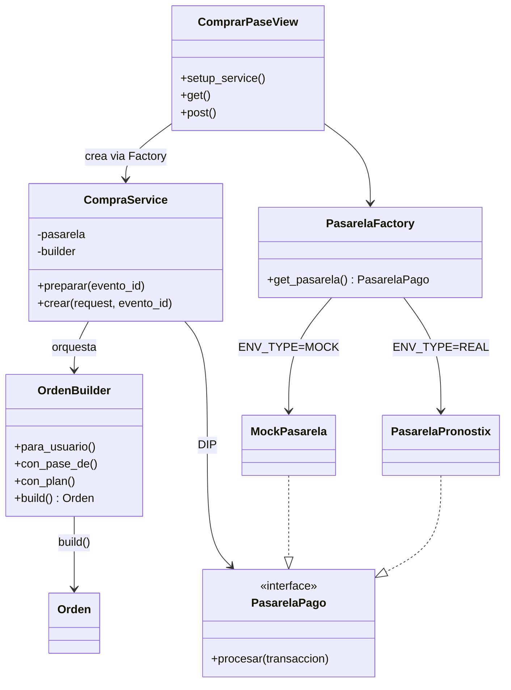
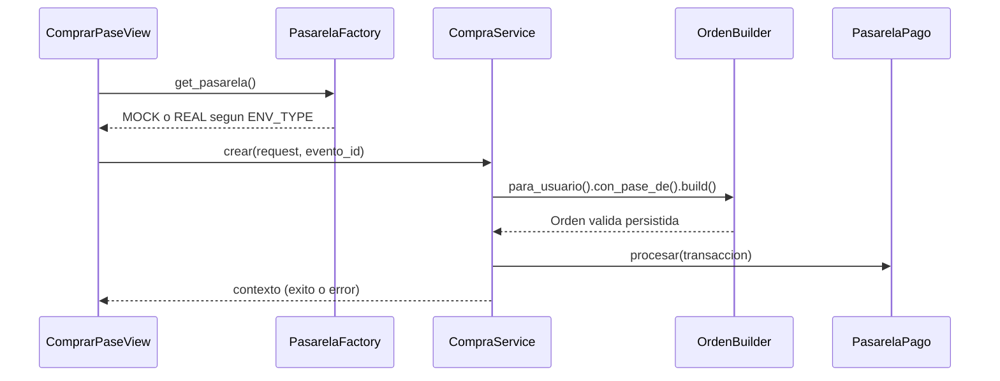

# Implementación del Patrón Creacional

**Proyecto:** Pronostix — proyecciones estadísticas para apuestas deportivas  
**Módulo:** Procesamiento de Compra de Pase Premium  
**Autores:** Juan David Sierra, Juan José Palacio, Camilo Soto  
**Curso:** Arquitectura de Software 2026 — Taller 01

## Problema

Comprar un pase premium implica validar el evento, armar una Orden con líneas, calcular IVA y liquidar el cobro en la pasarela propia (autorizar, capturar, evaluar riesgo). Si esa lógica vive en la vista de Django, se viola SRP, la vista crece con cada regla nueva y no se puede reutilizar el caso de uso desde una API.

## Solución arquitectónica

| Capa | Componente | Responsabilidad |
| --- | --- | --- |
| Interfaz | `ComprarPaseView` (CBV) | Captura el request y llama al servicio. Menos de 15 líneas. |
| Aplicación | `CompraService` | Orquesta Builder + pasarela inyectada (DIP). |
| Dominio | `OrdenBuilder` | Construye la orden con Fluent Interface y valida antes de `save()`. |
| Infraestructura | `PasarelaFactory` | Elige MOCK (consola) o REAL (pasarela propia con log) según `ENV_TYPE`. |

## Diagrama de clases



## Flujo



## Justificación de diseño

- **Service Layer:** la vista no conoce IVA, eventos finalizados ni cómo autoriza la tarjeta. Eso permite testear el caso de uso sin HTML y, más adelante, extraer Monetización a un microservicio (Strangler Pattern del dominio Pronostix).
- **Factory + variable de entorno:** `ENV_TYPE=MOCK` evita escribir logs reales en desarrollo. La vista no se modifica (OCP).
- **Builder:** impide persistir una orden incompleta, de un evento cerrado o de un plan gratuito. El cálculo de IVA queda encapsulado; el servicio se lee como un requerimiento de negocio.

## Snippet clave

```python
# services.py
def crear(self, request, evento_id):
    orden = (
        self.builder
        .para_usuario(self._usuario(request))
        .con_pase_de(evento)
        .build()
    )
    transaccion = Transaccion.objects.create(orden=orden, monto=orden.total)
    self.pasarela.procesar(transaccion)
```

## Cómo demostrar MOCK vs REAL

```powershell
# Desarrollo: imprime [DEBUG] Mock Pasarela... en la consola de Django
$env:ENV_TYPE="MOCK"; python manage.py runserver

# Pasarela propia: escribe pasarela_CAMILO_SOTO.log
$env:ENV_TYPE="REAL"; python manage.py runserver
```
